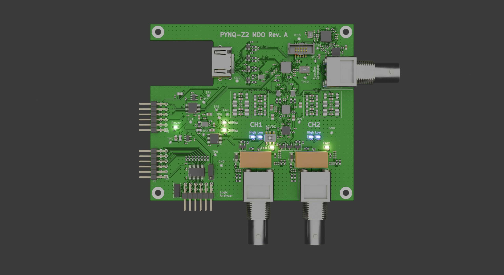

# PYNQ-Z2 Mixed-Signal Oscilloscope / MDO

<p align="center">
  
  
</p>

A custom **dual-channel 16-bit mixed-signal oscilloscope, logic-analyzer interface, and arbitrary-waveform/function-generator platform** designed around the **PYNQ-Z2**, **AD9655**, **AD9102**, **ADA4927-2**, and **ADA4817-2**.

The project covers the complete mixed-signal path from the BNC input to FPGA capture: input protection, selectable attenuation and coupling, high-speed amplification, switchable anti-alias filtering, fully differential ADC drive, source-synchronous converter interfacing, four-layer PCB implementation, waveform generation, SPICE simulation, post-layout analysis, and power-integrity analysis.

The current revision is a pre-fabrication design. Numerical bandwidth and waveform figures shown here are simulation or post-layout simulation results unless explicitly labeled as measured.

---

## System summary

| Subsystem | Implementation |
|---|---|
| Analog channels | 2 |
| ADC | AD9655BCPZ-125, dual 16-bit |
| ADC device sample rate | 125 MSPS |
| DUAL acquisition mode | 62.5 MSPS/channel simultaneous |
| FAST acquisition mode | 125 MSPS selected channel |
| Analog filtering | Selectable ~20 MHz / ~40 MHz anti-alias paths |
| Input range | High / Low attenuation |
| Input coupling | AC / DC selectable |
| Differential ADC driver | ADA4927-2 |
| High-speed amplifiers | ADA4817-2 |
| Function generator / AWG | AD9102, 14-bit DAC |
| AWG board clock | 156.25 MHz |
| AD9102 device capability | Up to 180 MSPS |
| FPGA platform | PYNQ-Z2 / XC7Z020 |
| PCB | 4-layer mixed-signal board |

---

## Instrument architecture

```text
                         ACQUISITION CHANNEL

BNC input
   │
   ├── Input protection
   ├── AC/DC coupling
   ├── High/Low attenuation
   │
   ▼
ADA4817-2 high-speed buffer / gain stage
   │
   ▼
Selectable 20 MHz / 40 MHz anti-alias network
   │
   ▼
TMUX1574 acquisition-mode switching
   │
   ▼
ADA4927-2 fully differential driver
   │
   ▼
AD9655 16-bit ADC
   │
   ▼
Source-synchronous differential interface
   │
   ▼
PYNQ-Z2 / XC7Z020
```

```text
                          WAVEFORM GENERATOR

PYNQ-Z2 control
   │
   ├── SPI / trigger / reset
   ▼
AD9102 14-bit waveform DAC
   │
   ▼
Analog reconstruction / output stage
   │
   ▼
ADA4817-2
   │
   ▼
50 Ω BNC output
```

---

## PCB implementation

### Standalone board

<p align="center">
  
  
</p>

### PYNQ-Z2 integration

<p align="center">
  
</p>

The board integrates two analog-input BNCs, a dedicated function-generator BNC, FPGA interconnects, logic-analyzer connectivity, clocking, power conversion, local low-noise regulation, and distributed test points.

### Copper layers

<p align="center">
  
  
</p>

<p align="center">
  
  
</p>

The four-layer layout uses a continuous reference plane for critical high-speed paths, dense ground stitching, short FDA-to-ADC interconnects, symmetric channel structures, localized converter decoupling, and physical separation between the acquisition, digital, power, and waveform-generation regions.

---

## Schematic

The top-level schematic contains the dual-channel acquisition chain, high/low attenuation control, selectable 20 MHz and 40 MHz filters, ADA4927-2 differential drive, AD9655 conversion, 125 MHz converter clocking, FPGA-level translation, logic-analyzer interface, power rails, and the function-generator subsystem.

[Full schematic PDF](docs/schematics/Pynq_Oscilloscope_schematic.pdf) · [PCB layer PDF](docs/pcb/Pynq_Oscilloscope_pcb_layers.pdf)

---

## Analog front end

The front end was developed as a complete loaded signal chain rather than as isolated amplifier stages. The simulation model includes attenuation, switching, filtering, FDA drive, and ADC loading.

### DUAL filter mode

<p align="center">
  
</p>

Post-layout simulation:

- CH1 `-3 dB` bandwidth: **~21.95 MHz**
- CH2 `-3 dB` bandwidth: **~21.96 MHz**
- CH1 attenuation at 31.25 MHz: **~36.08 dB**
- CH2 attenuation at 31.25 MHz: **~36.04 dB**

### FAST filter mode

<p align="center">
  
</p>

Post-layout simulation:

- CH1 `-3 dB` bandwidth: **~41.21 MHz**
- CH2 `-3 dB` bandwidth: **~41.25 MHz**
- CH1 attenuation at 62.5 MHz: **~41.86 dB**
- CH2 attenuation at 62.5 MHz: **~41.80 dB**

### Filter-mode comparison

<p align="center">
  
</p>

The two anti-alias paths align the analog bandwidth with the corresponding acquisition mode instead of using one fixed bandwidth for both operating conditions.

---

## High-frequency transient simulation

The transient matrix spans both input ranges and both acquisition modes. Each plot shows the fully differential amplifier output together with the differential voltage presented to the ADC input. The displayed interval is 200 ns so several waveform cycles and the initial settling behavior are visible in the same figure.

<p align="center">
  
  
</p>

<p align="center">
  
  
</p>

Common-mode behavior was evaluated separately at the FDA output and at the loaded ADC input. The simulation CSVs corresponding to these operating points are included under [`verification/raw/afe/`](verification/raw/afe/).

---

## Function generator / AWG

The waveform-generation subsystem is based on the **AD9102** and uses a **156.25 MHz board clock**. The DAC output is followed by the analog reconstruction/output stage and a dedicated 50 Ω BNC path.

### ADIsimDDS 

<p align="center">
  
  
</p>

### Board-level output simulation

<p align="center">
  
</p>

Post-layout simulation:

- `-3 dB` output-path bandwidth: **~84.74 MHz**
- 1 MHz BNC output with the modeled 50 Ω load: **~1.598 Vpp**
- ADA4817-2 output swing in the same simulation: **~3.199 Vpp**

<p align="center">
  
  
</p>

---

## Power distribution

The power architecture includes the PYNQ-derived supply, local 3.3 V distribution, bipolar analog rails, 1.8 V rails, and local low-noise regulation around the converter and analog circuitry.

PowerDC simulations were used to examine regulator output voltages, sink voltages, rail current, and board-level power loss.

<p align="center">
  
  
</p>

Additional PowerDC results are included in [`docs/assets/powerdc/`](docs/assets/powerdc/).

---

## Simulation and PCB validation

The project combines several analysis levels:

- **PSpice / SPICE:** AC response, large-signal transient behavior, ADC-loaded differential drive, common-mode behavior, switch/filter modes, and AWG output response.
- **Post-layout extraction:** critical analog and high-speed interconnect behavior with PCB parasitics.
- **Cadence Sigrity / PowerSI:** differential interconnect and return-path analysis for critical nets.
- **PowerDC:** regulator, sink-voltage, rail-current, and power-loss analysis.
- **KiCad:** schematic capture, four-layer PCB implementation, DRC, differential routing, stackup, and fabrication outputs.
- **FPGA:** AD9655 control, source-synchronous capture, acquisition-mode logic, buffering, triggering, and host communication.

The raw analog simulation data and the derived quantitative result table are under [`verification/`](verification/).

---

## Hardware characterization

Physical measurements begin after board fabrication. The characterization set covers input bandwidth, passband flatness, vertical gain and offset, channel matching, channel skew, ADC SNR/SINAD/ENOB/SFDR, timebase accuracy, AWG amplitude flatness and spectral purity, and end-to-end AWG-to-ADC loopback.

Those measurements are intentionally separate from the pre-fabrication simulation figures shown in this repository.

---

## Documentation

- [System architecture](docs/01_system_architecture.md)
- [Analog front end](docs/02_analog_frontend.md)
- [ADC and clocking](docs/03_adc_interface.md)
- [Function generator](docs/04_function_generator.md)
- [PCB layout](docs/05_pcb_layout.md)
- [Simulation results](docs/06_simulation_signoff.md)
- [Signal and power integrity](docs/07_signal_power_integrity.md)
- [Hardware bring-up and characterization](docs/08_bringup.md)
- [Design iteration history](docs/09_debugging_history.md)
- [Measurement methodology](docs/10_measurement_plan.md)
- [Results index](docs/11_results.md)

---

## Repository contents

```text
.
├── README.md
├── docs/
│   ├── 01_system_architecture.md
│   ├── 02_analog_frontend.md
│   ├── 03_adc_interface.md
│   ├── 04_function_generator.md
│   ├── 05_pcb_layout.md
│   ├── 06_simulation_signoff.md
│   ├── 07_signal_power_integrity.md
│   ├── 08_bringup.md
│   ├── 09_debugging_history.md
│   ├── 10_measurement_plan.md
│   ├── 11_results.md
│   ├── assets/
│   ├── schematics/
│   └── pcb/
├── verification/
│   ├── raw/
│   └── results/
├── fpga/
└── software/
```
