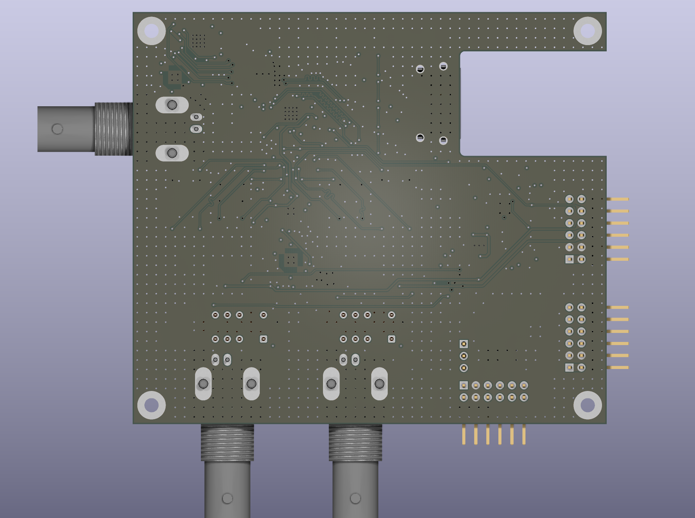
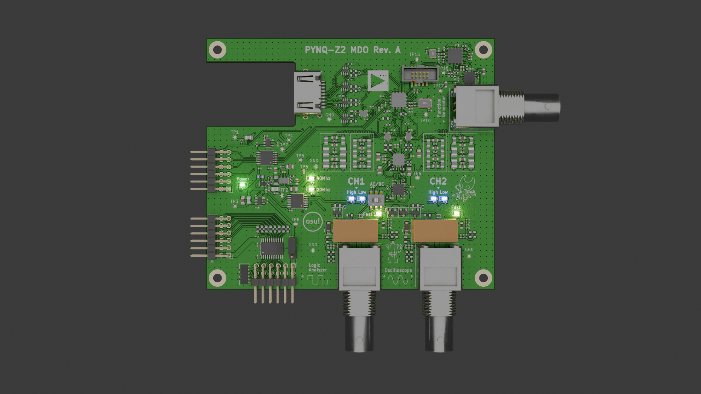
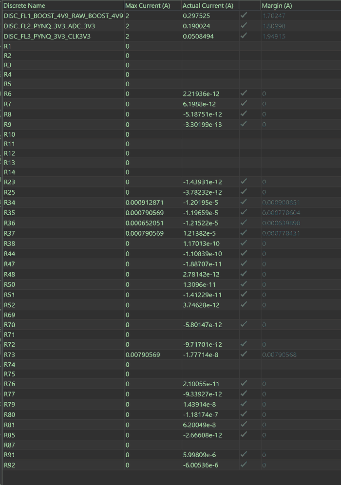
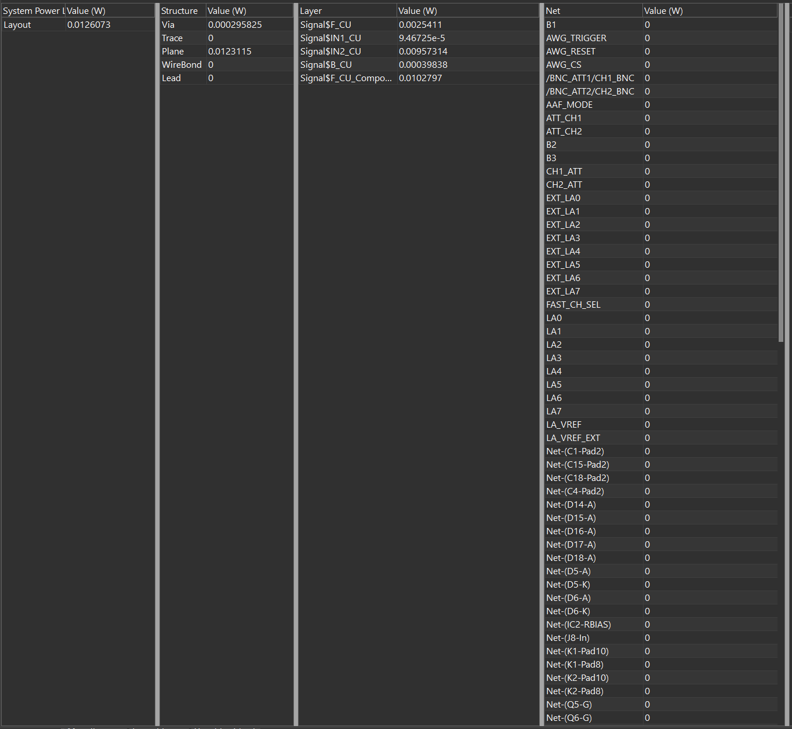
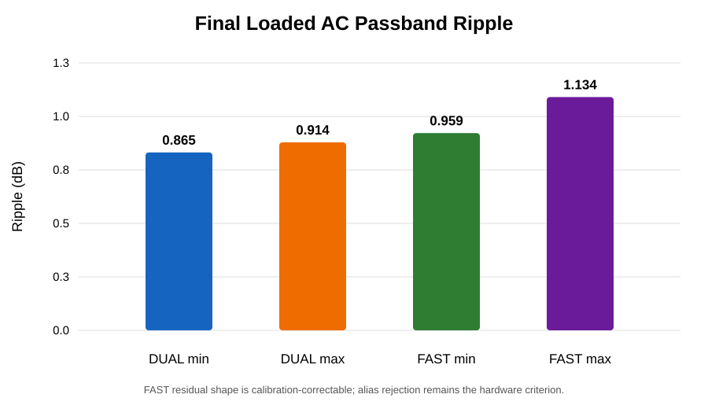
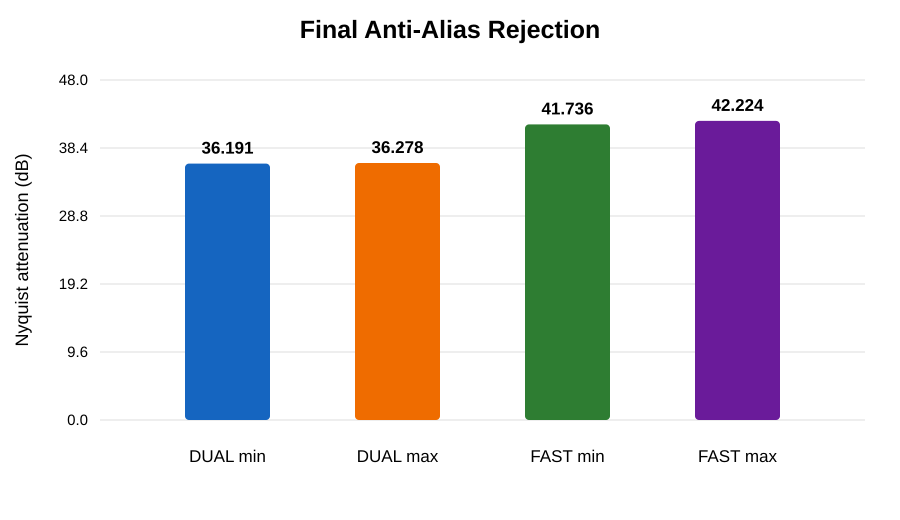
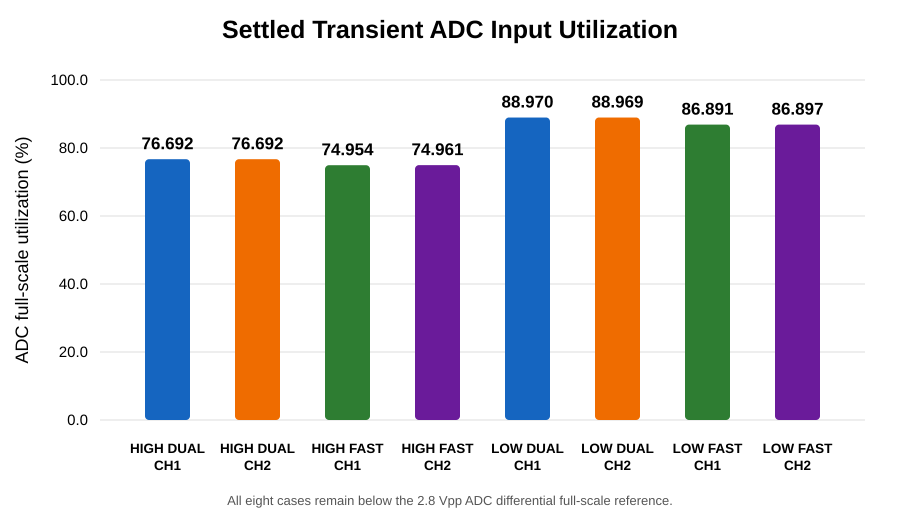
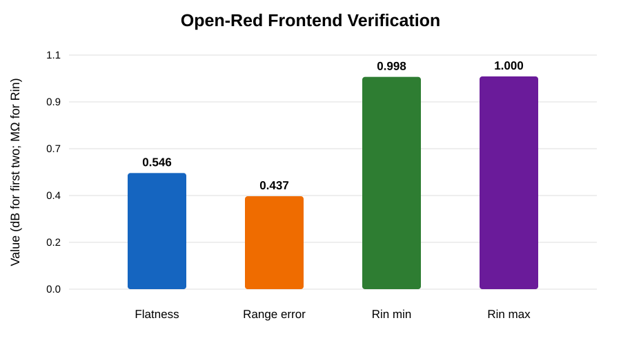

# PYNQ-Z2 Mixed-Signal Oscilloscope / MDO

<p align="center">
  
</p>

A custom **dual-channel 16-bit mixed-signal oscilloscope, logic-analyzer interface, and arbitrary-waveform/function-generator platform** built around the **PYNQ-Z2**, **AD9655**, **AD9102**, **ADA4927-2**, and **ADA4817-2**.

The project covers the complete mixed-signal path from BNC input to FPGA capture: input protection, selectable attenuation and coupling, high-speed amplification, switchable anti-alias filtering, fully differential ADC drive, source-synchronous converter interfacing, four-layer PCB implementation, waveform generation, SPICE simulation, post-layout extraction, signal-integrity analysis, and power-integrity analysis.

Rev. A is currently a **pre-fabrication design**. Numerical bandwidth, SINAD/ENOB, transient, SI and power figures below are simulation or post-layout results unless explicitly identified as measured.

## System summary

| Subsystem | Implementation |
|---|---|
| Analog channels | 2 |
| ADC | AD9655BCPZ-125, dual 16-bit |
| ADC clock | 125 MHz |
| DUAL acquisition | 62.5 MSPS/channel simultaneous |
| FAST acquisition | 125 MSPS selected channel |
| Analog filters | Selectable ~20 MHz / ~40 MHz |
| Input range | High / Low selectable |
| Input coupling | AC / DC selectable |
| ADC driver | ADA4927-2 |
| Input amplifier | ADA4817-2 |
| Waveform DAC | AD9102BCPZ, 14-bit |
| AWG board clock | 156.25 MHz |
| FPGA platform | PYNQ-Z2 / XC7Z020 |
| PCB | 4-layer mixed-signal board |

## Instrument architecture

```text
BNC input
  -> protection / AC-DC coupling / range selection
  -> ADA4817-2
  -> selectable 20 MHz / 40 MHz anti-alias filter
  -> TMUX1574 acquisition-mode switching
  -> ADA4927-2 differential driver
  -> AD9655 16-bit ADC
  -> source-synchronous differential interface
  -> PYNQ-Z2 / XC7Z020
```

```text
PYNQ-Z2 control
  -> AD9102 14-bit waveform DAC
  -> reconstruction / output network
  -> ADA4817-2 output stage
  -> 50 ohm BNC
```

## PCB

<p align="center">
  
  
</p>

<p align="center">
  
  
</p>

<p align="center">
  
</p>

The board integrates two analog-input BNCs, a dedicated waveform-generator BNC, FPGA interconnects, logic-analyzer connectivity, clocking, power conversion, local regulation and distributed test points. Critical high-speed routes use continuous reference planes, dense ground stitching and short FDA-to-ADC interconnects.

[Full schematic PDF](docs/schematics/Pynq_Oscilloscope_schematic.pdf) · [PCB layer PDF](docs/pcb/Pynq_Oscilloscope_pcb_layers.pdf)

## Analog front end

The analog section was evaluated as a loaded end-to-end path rather than as isolated stages. The model includes attenuation, switching, filtering, FDA drive, ADC loading, both channels, both range states and AC/DC coupling.

| Mode | -3 dB bandwidth | Passband ripple | Rejection at mode Nyquist |
|---|---:|---:|---:|
| DUAL | **22.054–22.073 MHz** | **0.865–0.914 dB** | **36.191–36.278 dB @ 31.25 MHz** |
| FAST | **41.368–41.471 MHz** | **0.959–1.134 dB** | **41.736–42.224 dB @ 62.5 MHz** |

The AC-coupled cases give a **3.441–3.471 Hz** high-pass corner. The input-range compensation uses **43 pF / 7.5 pF / 110 pF**, with **0.545893 dB** worst flatness, **0.436622 dB** worst HIGH/LOW separation error and **0.997589–0.999792 Mohm** input resistance.

<p align="center">
  
</p>

<p align="center">
  
</p>

## High-frequency transient simulation

The transient set spans both input ranges and both acquisition modes. The plots show FDA differential output and the loaded differential signal at the ADC input.

<table>
<tr>
<td width="50%" valign="top" align="center"><strong>LOW · FAST · 40 MHz</strong><br><br></td>
<td width="50%" valign="top" align="center"><strong>LOW · DUAL · 20 MHz</strong><br><br></td>
</tr>
<tr>
<td width="50%" valign="top" align="center"><strong>HIGH · FAST · 40 MHz</strong><br><br></td>
<td width="50%" valign="top" align="center"><strong>HIGH · DUAL · 20 MHz</strong><br><br></td>
</tr>
</table>

All eight settled operating cases remain below the **2.8 Vpp differential ADC full-scale reference**; the largest simulated utilization is **88.97%**.

## ADC + AFE dynamic-performance model

Across the four principal operating cases, the pre-fabrication model gives:

- system SINAD: **75.54–76.97 dB**
- system ENOB: **12.255–12.493 bits**
- useful-band AFE noise: **~25.4–26.0 uV RMS** in DUAL and **~36.3–36.8 uV RMS** in FAST
- modeled AFE-induced SINAD degradation: **~0.25–0.50 dB**

These values are simulated, not hardware measurements.

## Function generator / AWG

The waveform-generation subsystem uses an **AD9102** with a **156.25 MHz board clock**, followed by the analog reconstruction/output network and an ADA4817-2 output stage.

Post-layout output-path simulation gives approximately **84.7425 MHz** -3 dB bandwidth, **1.598 Vpp** at the modeled 50 ohm BNC in the 1 MHz transient case, and **3.199 Vpp** at the amplifier side of the modeled 50 ohm division.

<p align="center">
  
  
</p>

## Signal and power integrity

The passive-SI set covers the ADC digital interface, clocks, analog interconnects and the D1B branch to J9. The Sep-13 campaign contains **12 completed PowerSI result sets**.

For the focused D1B/J9 extraction, the S6P contains **4005 points from 1 MHz to 10 GHz**, is passive and reciprocal to numerical precision. At 500 MHz the extracted transmission is **-3.808 dB to U9** and **-3.278 dB to J9**; J9 P/N skew is **29.7 ps** and differential-to-common conversion is **-29.1 dB**.

PowerDC was run with the completed AWG load model, including the TPS61033 boost stage, LM27762 bipolar rails, AD9102, clock load and ADA4817-2 AWG stage. The repository includes the resulting regulator-voltage, sink-voltage, discrete-current and board-loss captures.

<p align="center">
  
</p>

<p align="center">
  
</p>

<p align="center">
  
</p>

<p align="center">
  
</p>

## Verification summary

<p align="center">
  
</p>

<p align="center">
  
</p>

<p align="center">
  
</p>

<p align="center">
  
</p>

| Item | Result |
|---|---|
| DUAL anti-alias response | **PASS** |
| FAST anti-alias response | **PASS** |
| AC-coupling transfer | **PASS** |
| FDA/ADC loaded transients | **PASS** |
| ADC + AFE performance model | **PASS** |
| HIGH/LOW range scaling | **PASS** |
| ADC digital passive SI | **PASS** |
| AWG post-layout simulation | **PASS** |
| PowerDC with AWG loads | **PASS** |
| PCB DRC / ERC | **0 violations / 0 warnings** |
| Hardware characterization | **After fabrication** |

## Tools

- **KiCad** — schematic capture, four-layer layout, DRC and fabrication outputs
- **Cadence PSpice** — analog AC, transient, bias and loaded converter-interface simulation
- **Cadence Sigrity PowerSI** — post-layout passive extraction and SI analysis
- **Cadence Sigrity PowerDC** — board-level power-distribution analysis
- **MATLAB** — simulation-data analysis and plotting
- **ADI tools / vendor models** — converter and waveform-generation modelling

## Documentation

- [System architecture](docs/01_system_architecture.md)
- [Analog front end](docs/02_analog_frontend.md)
- [ADC and clocking](docs/03_adc_interface.md)
- [Function generator](docs/04_function_generator.md)
- [PCB layout](docs/05_pcb_layout.md)
- [Simulation results](docs/06_simulation_results.md)
- [Signal and power integrity](docs/07_signal_power_integrity.md)
- [Hardware bring-up](docs/08_bringup.md)
- [Engineering iteration notes](docs/09_debugging_history.md)
- [Measurement methodology](docs/10_measurement_plan.md)
- [Results index](docs/11_results.md)
