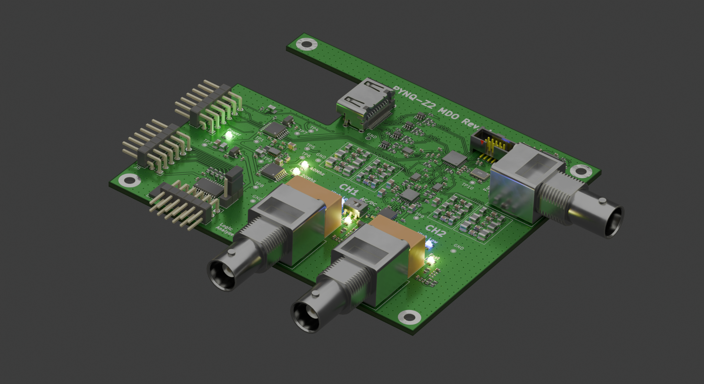
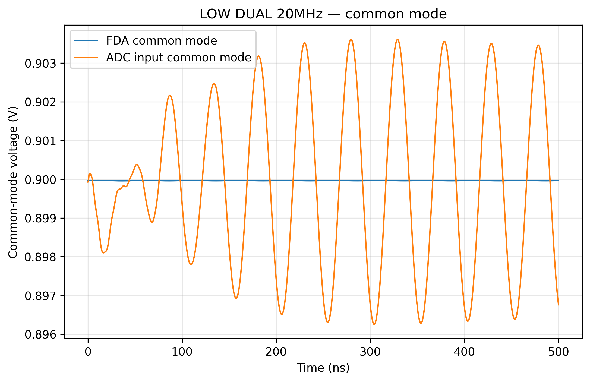

# PYNQ-Z2 Mixed-Signal Oscilloscope / MDO

<p align="center">
  
</p>

A custom **dual-channel 16-bit mixed-signal oscilloscope, logic-analyzer interface, and arbitrary-waveform/function-generator platform** built around the **PYNQ-Z2**, **Analog Devices AD9655**, **AD9102**, **ADA4927-2**, and **ADA4817-2**.

This repository is an engineering case study of the complete signal chain: analog input protection and attenuation, high-speed amplification, selectable anti-alias filtering, fully differential ADC drive, source-synchronous converter interfacing, mixed-signal PCB layout, function generation, SPICE verification, post-layout validation, signal/power-integrity work, and hardware bring-up planning.

> **Status:** pre-fabrication / pre-hardware-characterization. Every numerical performance result in this repository is explicitly identified as simulated or post-layout simulated unless marked as measured.

---

## Hardware at a glance

| Subsystem | Implementation |
|---|---|
| Analog channels | 2 |
| ADC | AD9655BCPZ-125, dual 16-bit |
| ADC maximum device rate | 125 MSPS |
| DUAL acquisition architecture | 62.5 MSPS/channel simultaneous |
| FAST acquisition architecture | 125 MSPS selected channel |
| Analog filtering | Selectable ~20 MHz / ~40 MHz AAF paths |
| Input range control | High / Low attenuation |
| Input coupling | AC / DC selectable |
| Differential ADC driver | ADA4927-2 |
| High-speed front-end amplifiers | ADA4817-2 |
| Function generator / AWG | AD9102, 14-bit DAC |
| AWG board clock | 156.25 MHz |
| AD9102 device capability | Up to 180 MSPS |
| Logic analyzer | External digital header / level-shifted interface |
| FPGA platform | PYNQ-Z2 / XC7Z020 |
| PCB | 4-layer mixed-signal board |

The schematic uses the AD9655 as the 16-bit conversion core and includes 125 MHz converter clocking, dual analog channels, switched anti-alias networks, ADA4927-2 differential drive, TMUX1574 switching, level translation, HDMI/Pmod-style digital interfaces, and an AD9102 function-generator subsystem. The top-level sheet labels the 20 MHz and 40 MHz filters, attenuation control, fast-channel selection, logic analyzer, clocking, and function generator explicitly.

---

## Board renders

### Standalone instrument PCB

<p align="center">
  
  
</p>

### PYNQ-Z2 integration

<p align="center">
  
</p>

The board mechanically mates with the PYNQ-Z2 and exposes two analog input BNCs, a function-generator BNC output, power/control headers, logic-analyzer connectivity, and the FPGA interface.

---

## Signal-chain architecture

```text
                    ACQUISITION CHANNEL

BNC input
   │
   ├── Protection
   ├── AC/DC coupling
   ├── High / Low attenuation
   │
   ▼
ADA4817-2 high-speed buffer / gain stage
   │
   ▼
Selectable 20 MHz / 40 MHz analog anti-alias network
   │
   ▼
TMUX1574 acquisition-mode switching
   │
   ▼
ADA4927-2 fully differential amplifier
   │
   ▼
AD9655 16-bit ADC
   │
   ▼
Source-synchronous differential digital interface
   │
   ▼
PYNQ-Z2 / XC7Z020
```

```text
                     WAVEFORM GENERATOR

PYNQ-Z2 control
   │
   ├── SPI / trigger / reset
   ▼
AD9102 14-bit waveform DAC
   │
   ▼
Differential-to-single-ended / output filtering
   │
   ▼
ADA4817-2 output stage
   │
   ▼
50 Ω BNC output
```

---

## Analog-front-end results

These are **simulation / post-layout simulation results**, not bench measurements.

### DUAL anti-alias mode

<p align="center">
  
</p>

From the validated final AFE response CSV:

- CH1 simulated `-3 dB` bandwidth: **~21.95 MHz**
- CH2 simulated `-3 dB` bandwidth: **~21.96 MHz**
- CH1 simulated attenuation at 31.25 MHz Nyquist: **~36.08 dB**
- CH2 simulated attenuation at 31.25 MHz Nyquist: **~36.04 dB**

### FAST anti-alias mode

<p align="center">
  
</p>

- CH1 simulated `-3 dB` bandwidth: **~41.21 MHz**
- CH2 simulated `-3 dB` bandwidth: **~41.25 MHz**
- CH1 simulated attenuation at 62.5 MHz Nyquist: **~41.86 dB**
- CH2 simulated attenuation at 62.5 MHz Nyquist: **~41.80 dB**

### FAST vs DUAL

<p align="center">
  
</p>

The two switchable AAF paths allow the analog bandwidth to track the acquisition mode instead of using one fixed filter for both operating points.

See [Analog Front End](docs/02_analog_frontend.md) and [Simulation Signoff](docs/06_simulation_signoff.md).

---

## Full-scale / high-frequency transient verification

The validated transient matrix covers:

- Low range + FAST mode at 40 MHz
- Low range + DUAL mode at 20 MHz
- High range + DUAL mode at 20 MHz
- High range + FAST mode at 40 MHz

<p align="center">
  
  
</p>

Common-mode behavior is also tracked independently at the FDA output and ADC input:

<p align="center">
  
  
</p>

Raw data is kept under [`verification/raw/`](verification/raw/) so the figures can be regenerated instead of treated as screenshots.

---

## Function generator / AWG

The board includes an **AD9102** waveform-generation subsystem. The schematic clocks the AD9102 at **156.25 MHz** and routes its differential current outputs through an analog output stage to a dedicated BNC.

### ADIsimDDS device-level check

<p align="center">
  
  
</p>

### Post-layout AWG signal-path response

<p align="center">
  
</p>

Validated post-layout simulation:

- Simulated `-3 dB` output-path bandwidth: **~84.74 MHz**
- Accepted 1 MHz transient at the 50 Ω BNC: **~1.598 Vpp**
- Corresponding output-amplifier swing: **~3.199 Vpp**

<p align="center">
  
  
</p>

See [Function Generator](docs/04_function_generator.md).

---

## Four-layer PCB design

<p align="center">
  
  
</p>

<p align="center">
  
  
</p>

The board uses a four-layer mixed-signal architecture with:

- dense ground stitching;
- continuous reference-plane coverage under critical routes;
- controlled high-speed routing around the ADC/FPGA interface;
- deliberately short FDA-to-ADC connections;
- separated analog-input channel structures;
- localized decoupling around converter, amplifier, clock, and logic sections;
- dedicated power conversion and low-noise regulator stages;
- dedicated function-generator region;
- physical separation between acquisition channels and digital connectors.

See [PCB Layout](docs/05_pcb_layout.md).

---

## Power integrity evidence

PowerDC was used to review regulator/source delivery and sink voltages.

<p align="center">
  
  
</p>

Additional PowerDC evidence in [`docs/assets/powerdc`](docs/assets/powerdc/) includes discrete current and power-loss summaries.

These screenshots are retained as simulation evidence; they are not substitutes for physical rail measurements during board bring-up.

---

## Schematic and PCB exports

- [Complete 4-page schematic PDF](docs/schematics/Pynq_Oscilloscope_schematic.pdf)
- [PCB layer/export PDF](docs/pcb/Pynq_Oscilloscope_pcb_layers.pdf)

The schematic export is generated from KiCad 10 and includes the top-level architecture, channel-1 attenuation sheet, channel-2 attenuation sheet, and function-generator sheet.

---

## Verification strategy

The project uses an evidence ladder rather than a single simulator:

1. **Schematic audit**
   - topology;
   - biasing;
   - component ratings;
   - converter interface requirements;
   - protection and switching states.

2. **PSpice / SPICE**
   - AC response;
   - passband/stopband;
   - full-scale transients;
   - ADC-loaded FDA behavior;
   - common-mode behavior;
   - range/filter-mode combinations;
   - tolerance / Monte Carlo where applicable;
   - AWG output path.

3. **PCB verification**
   - DRC;
   - component/footprint review;
   - differential routing;
   - return-path continuity;
   - ground stitching;
   - power-distribution topology;
   - fabrication review.

4. **Post-layout SI / PI**
   - extracted critical networks;
   - differential interconnect behavior;
   - return paths;
   - PowerSI/Sigrity evidence;
   - PowerDC rail verification;
   - PDN review.

5. **FPGA verification**
   - ADC initialization;
   - test patterns;
   - lane reconstruction;
   - source-synchronous timing;
   - trigger/capture logic;
   - DMA and software protocol.

6. **Hardware characterization**
   - power rails;
   - clocks;
   - ADC patterns;
   - analog bandwidth;
   - FFT/SNR/SINAD/ENOB/SFDR;
   - channel skew;
   - AWG amplitude/flatness/spectrum;
   - loopback calibration.

See [Verification and Signoff](docs/06_simulation_signoff.md), [SI/PI](docs/07_signal_power_integrity.md), and [Bring-up](docs/08_bringup.md).

---

## Repository structure

```text
.
├── README.md
├── docs/
│   ├── 01_system_architecture.md
│   ├── 02_analog_frontend.md
│   ├── 03_adc_interface.md
│   ├── 04_function_generator.md
│   ├── 05_pcb_layout.md
│   ├── 06_simulation_signoff.md
│   ├── 07_signal_power_integrity.md
│   ├── 08_bringup.md
│   ├── 09_debugging_history.md
│   ├── 10_measurement_plan.md
│   ├── 11_results.md
│   ├── assets/
│   ├── schematic/
│   └── pcb/
├── verification/
│   ├── raw/
│   └── results/
├── tools/
│   ├── matlab/
│   └── windows/
├── fpga/
└── software/
```

---

## Rebuilding the plots

MATLAB:

```matlab
cd tools/matlab
rebuild_figures
```

The script reads the committed CSV evidence and regenerates the primary AFE and AWG plots. Raw data remains the source of truth.

---

## Current open gates

The PCB and simulation evidence are substantially ahead of physical hardware validation. The following are intentionally **not** claimed as measured:

- oscilloscope ENOB;
- SNR / SINAD / SFDR;
- calibrated vertical accuracy;
- measured input bandwidth;
- measured channel-to-channel skew;
- measured clock jitter;
- measured AWG THD/SFDR;
- measured load regulation;
- final FPGA timing margin;
- long-duration capture integrity.

Those become measured claims only after the fabricated board is characterized with independently traceable test equipment.

---

## Design documentation

- [System architecture](docs/01_system_architecture.md)
- [Analog front end](docs/02_analog_frontend.md)
- [ADC and clocking](docs/03_adc_interface.md)
- [Function generator](docs/04_function_generator.md)
- [PCB layout](docs/05_pcb_layout.md)
- [Simulation signoff](docs/06_simulation_signoff.md)
- [Signal and power integrity](docs/07_signal_power_integrity.md)
- [Bring-up workflow](docs/08_bringup.md)
- [Debugging history](docs/09_debugging_history.md)
- [Measurement plan](docs/10_measurement_plan.md)
- [Results index](docs/11_results.md)

---

## Project intent

This project is intentionally documented as an **analog/mixed-signal engineering artifact**, not merely an FPGA demo. The primary design work is the conversion signal chain, analog filtering, high-speed differential drive, clock/data interfaces, mixed-signal PCB implementation, pre-fabrication verification, and the methodology used to turn simulations into measurable hardware acceptance criteria.
